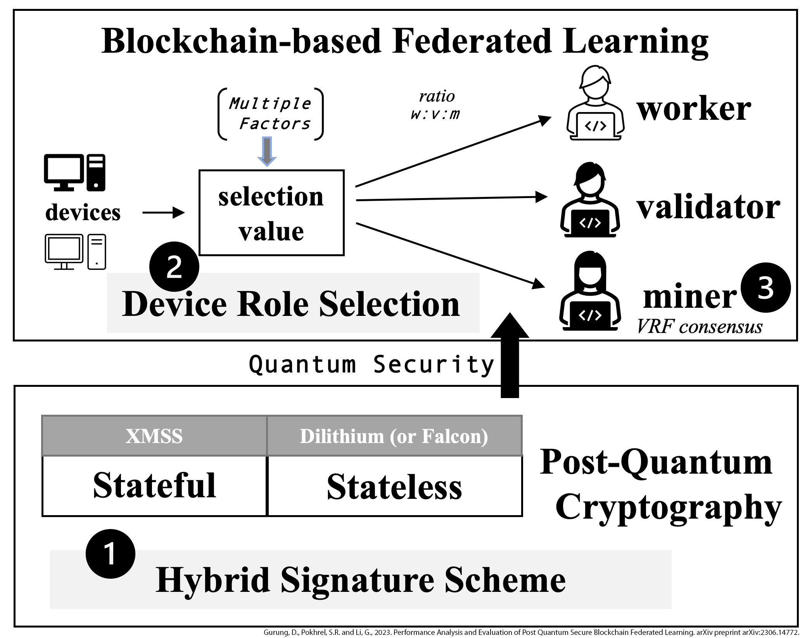

# Performance Analysis and Evaluation of Post Quantum Secure Blockchained Federated Learning

This repository contains the code used for the paper 
titled **"Performance Analysis and Evaluation of Post Quantum Secure Blockchained 
Federated Learning"**. 

  

## Abstract
As the field of quantum computing progresses, traditional cryptographic 
algorithms such as RSA and ECDSA are becoming increasingly vulnerable to quantum-based 
attacks, underscoring the need for robust post-quantum security in critical systems like 
Federated Learning (FL) and Blockchain. In light of this, we propose a novel hybrid 
approach for blockchain-based FL (BFL) that integrates a stateless signature scheme, 
such as Dilithium or Falcon, with a stateful hash-based scheme like XMSS. 
This combination leverages the complementary strengths of both schemes to 
provide enhanced security. To further optimize performance, we introduce a 
linear formula-based device role selection method that takes into account key 
factors such as computational power and stake accumulation. This selection process 
is reinforced by a verifiable random function (VRF), which strengthens the blockchain 
consensus mechanism. Our extensive experimental results demonstrate that this hybrid 
approach significantly enhances both the security and efficiency of BFL systems, 
establishing a robust framework for the integration of post-quantum cryptography 
as we transition into the quantum computing era.

## Paper
- **Arxiv Preprint**: []
- **Journal Version**: []

